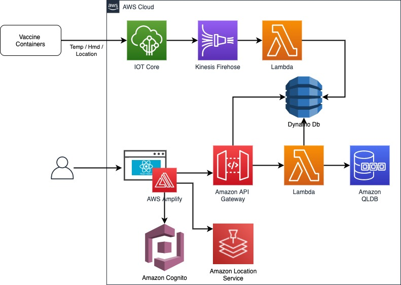

# Vaccine Distribution

## Project Overview
This prototype aims to address supply-chain challenges in vaccine distribution. An IoT sensor in each container allows the distributor to monitor temperature and humidity during transportation. The sensor also allows distributor to track the location in near-real time. The solution implements a blockchain smart-contract based on AWS Quantum Ledger Database.

## High level Architecture

## Deployment 
To deploy this solution into your AWS Account please follow our [Deployment Guide](docs/deployment_guide.md) 
 
### Further Recommendations 
This is a proof of concept done by UBC CIC in collaboration with UBC faculty and students. 
## License
This project is distributed under the [MIT License](./LICENSE).
