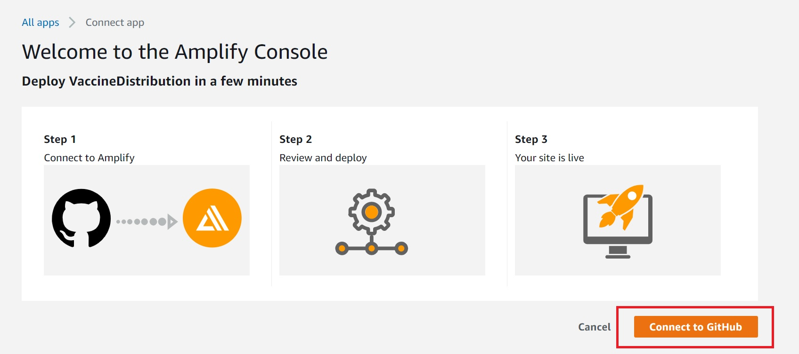
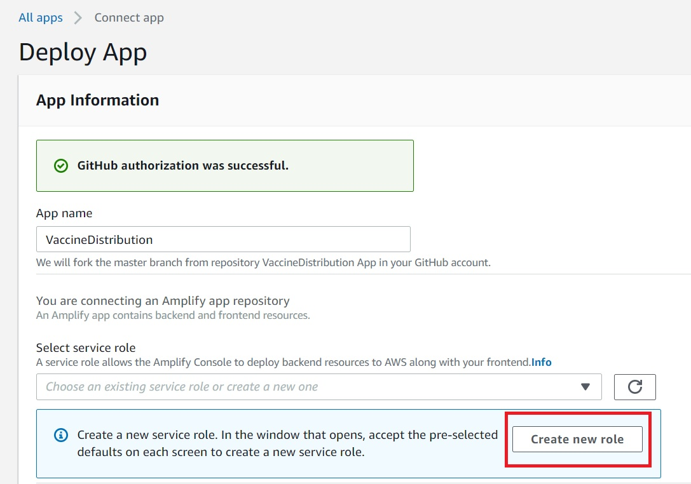
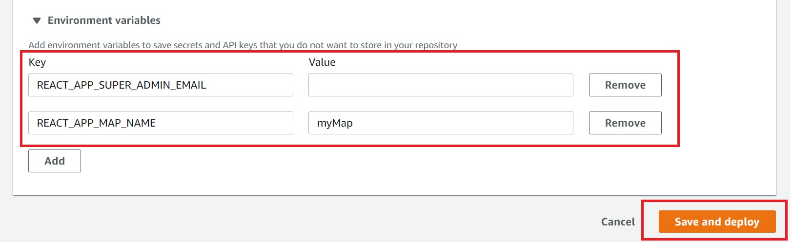
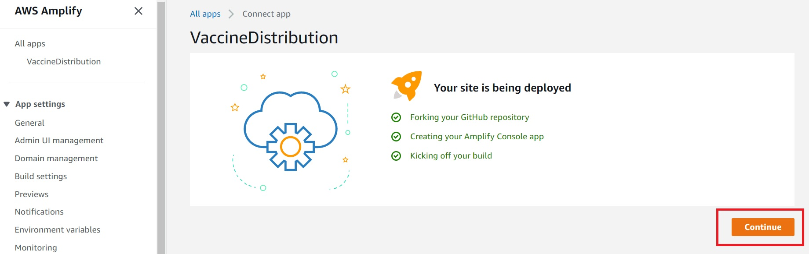

## Requirements
Before you deploy, you must have following in place:
- AWS Account
- GitHub Account

The **Deploy to Amplify Console** button will take you to your AWS console to deploy the front-end solution. Make sure you are connecting to the same AWS Account you deployed the backend solutio.

The follow screenshots shows how simple this step is:

Make sure there is service role to deploy the backends resources

Under Deploy app, click on Environment variables. Please add the following environment variables. The REACT_APP_SUPER_ADMIN_EMAIL correspond to the email that you will use as the super admin for the aplication. Once the applicatio is install don't forget to create a new user using the email provided in this field. The REACT_APP_MAP_NAME allows you to give a name to the application. 

After adding the environmental variables, click Save and deploy

Wait until the Provision, Build, Deploy and Verify are all green

